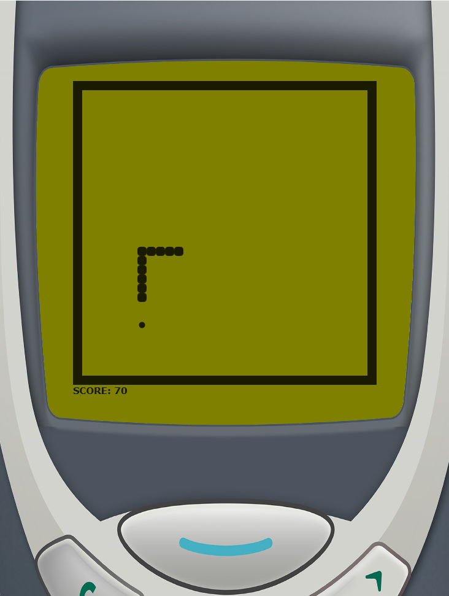

# Snake Game - Java/Javafx


## Introduction

This repository contains a Java and JavaFX implementation of the classic Snake game, developed for the "Software Development Methods" exam at the University of Trieste.

The goal of the project was to create a game while applying key principles from the course, such as Continuous Integration (CI), automated testing, and Test-Driven Development (TDD) to promote iterative code improvement.

The project is built using Gradle.
## Gameplay
<p align="center">

</p>

### Objective

Control the snake to eat food, grow longer, and avoid collisions with the edges of the field or your own body. As the snake grows, so does your score.

### How to Play

1. Start the Game: Click "Play" to begin.
2. Control the Snake:

    * W Arrow: Move up
    * S Arrow: Move down
    * A Arrow: Move left
    * D Arrow: Move right

3. Eat Food: Each time the snake consumes food, it grows longer and your score increases.
4. Avoid Collisions: Hitting the edges of the field or the snake's own body results in a game over.

## Project Structure

We organized the structure in the following directories:

- `/logic`: Contains the core game logic.
- `/main`: Is responsible for initializing the game.
- `/model`: Defines the game models such as Board, Fruit, and Snake, representing the game's core elements.
- `/view`: This package is responsible for the game's visual representation.

## Requirements

- Java 22
  
- JavaFX SDK properly set up in your environment.

Gradle will manage additional dependencies, so building the project is straightforward.

## Building and Running the Project

To build and run the project, follow these steps:

1. Clone the repository:
```
git clone https://github.com/JiacoDev/SnakeSDM24.git
```

2. Navigate into the project directory:

```
cd SnakeSDM24
```

4. Build the project using Gradle:

```
./gradlew build
```

5. Run the game:
```
./gradlew run
```

## Testing

This project integrates automated tests to ensure code reliability and prevent regressions. Run the tests with:

```
./gradlew test
```

The tests follow a Test-Driven Development (TDD) approach, ensuring that new features are well-tested from the start.
All the classes in `/logic` and `/model` are fully tested, while all the classes related to graphic elements in the package `/view` are not tested.

## Javadoc Documentation

Javadoc is used to document the project's classes and methods. You can generate the documentation using Gradle:
```
./gradlew javadoc
```
The generated documentation will be available in the `build/docs/javadoc` directory
gradle javadoc

## License

- This project is licensed under the MIT License. See the _license_ file for more details.

## Authors
- Emanuele Giacomazzi
- Francesco Poloni
- Giacomo Guidolin
- Nicolò Davide


